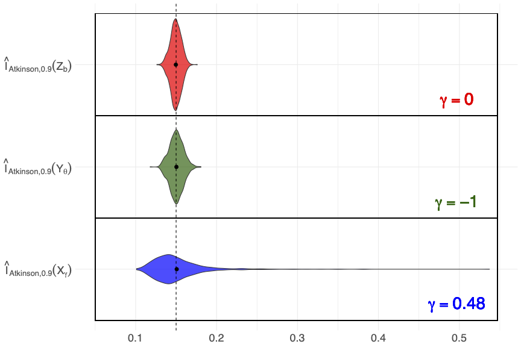

# A New Family of Inequality Indices: axioms, inference and tail properties

## Abstract
Inequality indices provide a quantitative framework for measuring disparity within a distribution, particularly in wealth or income. First, we introduce a unified family of inequality indices that encompasses several classical ones, including Gini, Atkinson, extended Gini, Bonferroni and Mehran indices. Second, we prove, under appropriate conditions, that indices within this family satisfy six  axioms widely accepted in the literature. Third, two general estimators are proposed for this class and their asymptotic normality is established under mild assumptions. Besides, it has been observed that the Gini index is robust to changes in the highest incomes. Leveraging extreme-value theory, we prove a feature shared by the entire family: non-discrimination of tail behaviours in terms of maximum domains of attraction. Notably, this property also holds for several alternatives to the Gini index, including those previously cited. These results are illustrated both  on simulated data and on a real income data set.

## Usage

Do not forget to install the required packages.

### To reproduce Figure 1

Download and execute 'Density&Lorenz-curves.R'.

### To reproduce the simulations part 

Download and execute 'Simulations.R' to reproduce results of the Section 5: Illustration on simulated data (Figures 3 and 4).

### To reproduce the real data set part 

Download and execute 'Real-data.R' to reproduce results of the Section 6: Illustrations on an income data set. 

Namely:

- Subsection 6.1: Illustration of the non-discrimination of upper tails (Figure 5)
- Subsection 6.2: Comparison of individual and grouped data estimators of the Gini index (confidence intervals)

**Reference**: J. El-methni, S. Girard & P. Laveur, "A new family of inequality indices: axioms, inference and tail properties", https://hal.science/hal-05153188.

<i>Violin plot computed on 1000 replications of the estimated Atkinson index with parameter $\eta=0.9$ on samples of size 1000 from three distributions (in blue Pareto, in green Beta and in red Weibull) with common theoretical Atkinson index equal to 0.15 (dotted vertical line).</i>

